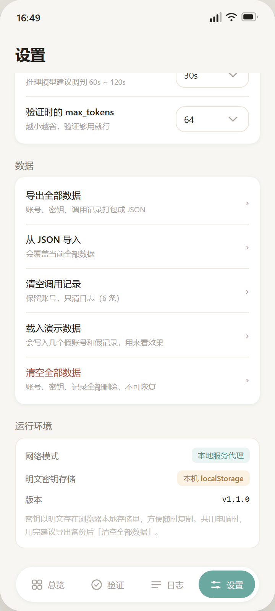

# AI API Hub

把散落在各家平台的大模型 API，集中到一处管理。

统一看余额、管密钥、一键复制 BaseURL，还能**直接选模型发一句话**验证这把密钥到底能不能用 —— 每次调用的 token、耗时、费用都自动记档。

网页版和安卓 App 都做出来了，用的是同一份前端代码。

| 总览 | 接口验证 | 调用日志 | 账号详情 | 设置 |
| :---: | :---: | :---: | :---: | :---: |
|  |  |  |  |  |

---

## 它解决什么问题

从各家平台注册 API 之后，真实的麻烦是这样的：密钥散在十几个控制台的收藏夹里，余额要一个个登录去看，想确认「这把密钥还能不能用」得翻出 curl 命令手敲一遍，一个月下来花了多少钱完全没数。

这个工具把这四件事收进一个地方：

**1. 平台与账号管理**
一个平台下可以挂多个账号（主号 / 备用号 / 测试号）。总览按平台合并显示余额，点开看每个账号各剩多少。顶部那条总计刻意压低了存在感 —— 它只是个参考，不该抢占注意力。

**2. 密钥保管与复制**
密钥只写在本机，不上传任何服务器。默认打码，一键复制密钥、复制 BaseURL，或者把整套凭证一次复制走。

**3. 接口验证（真发请求）**
选账号 → 选模型（真去拉 `/v1/models`，不是写死的列表）→ 发一句话。能正常收到回复，这把密钥就是可用的。

**它对上游的返回格式不挑食**，这一点看着琐碎，实际上是能不能用的分水岭。所谓「OpenAI 兼容」至少有三副面孔，工具三种都认：

| 上游返回 | 例子 | 处理 |
| --- | --- | --- |
| 标准非流式 | `{"object":"chat.completion"}` | 直接取 `choices[0].message.content` |
| **SSE 流式** | `data: {"object":"chat.completion.chunk"}` | 逐片 `delta.content` 攒成完整正文 |
| 单个 chunk | `{"object":"chat.completion.chunk"}` | 当成只有一片的流处理 |

第二种最容易踩：**请求体里明明写着 `stream: false`，相当多中转站照样硬吐 SSE。** 只按第一种解析的话，HTTP 200 的可用密钥会被自己判成「无法解析 / 请求失败」——明明能用的 Key 显示成红的。

失败时不说「请求错误」，而是告诉你该干什么：

| 情况 | 界面会说什么 |
| --- | --- |
| 401 | 密钥无效或已被撤销 |
| 403 | 密钥有效，但没这个模型的权限 |
| 404 | BaseURL 或接口路径不对 |
| 429 | 被限流了 / 额度耗尽 |
| 5xx | 上游服务异常，不是你的配置问题 |
| 超时 | 请求在 N 秒内没有响应，已主动中断 |
| 域名不通 | 请求没能发出去 |
| 跨域 | 浏览器拦住了，用 `npm start` 打开 |
| 认不出 | HTTP 通了但格式不认识 —— 附原始返回，可直接拿去适配 |

还有一个容易搞错的分界：**HTTP 200 + 正文是空的**，不等于失败。有些模型（尤其是带推理的）只回推理内容不给最终答案，这仍然证明密钥和链路是通的，界面会照实说「接口连通 · 但没返回正文」，而不是报错。

**4. 调用日志**
每次调用都留档：模型、输入/输出 token、响应耗时、估算费用、回复预览。费用按内置参考单价估算，模型名支持前缀匹配，所以 `gpt-4o-2024-08-06` 会命中 `gpt-4o` 的单价。**查不到单价的模型显示「未知单价」而不是 0** —— 报 0 是在骗自己。

流式响应基本不会回 `usage`（除非上游支持 `stream_options.include_usage`）。这种情况下不空着，而是按字符给个量级估算，并明确标成 `≈ 60 tokens（估）`—— 估算就是估算，不装成实测值。

---

## 两种形态，一份代码

| 形态 | 怎么用 | 怎么绕开跨域 |
| --- | --- | --- |
| **网页版** | `npm start`，浏览器开 `http://127.0.0.1:8787` | 本地 Node 服务做转发代理 |
| **安卓 App** | 装 `app/dist/API-Hub-1.1-debug.apk` | Capacitor 原生 HTTP，浏览器不参与 |

前端只有一套（`app/www/`），运行时自己判断在哪个壳里：

```
window.Capacitor.Plugins.CapacitorHttp 存在？ → native（APK）
/api/health 有响应且是本站？              → proxy （网页版，本地服务）
都没有                                    → direct（会被跨域拦，界面明确提示）
```

为什么要绕这么一圈：**浏览器里直接对 `api.openai.com` 发请求，一定会被 CORS 拦死。** 这不是配置问题，是浏览器的安全模型。所以「填 Key 就能真发请求」必须有个东西替它发 —— 要么本地服务，要么原生壳。两条路都搭好了。

---

## 跑起来

### 网页版

```bash
cd app
npm install
npm start            # → http://127.0.0.1:8787
```

Windows 上也可以直接双击 `app/start.bat`。

> 直接双击 `www/index.html` 也能打开，但会进 direct 模式，调 API 可能被拦。要真发请求就得走 `npm start`。

### 安卓 App

```bash
adb install -r app/dist/API-Hub-1.1-debug.apk
```

包信息：`com.aihub.app` · 版本 1.1 · minSdk 24（Android 7.0 起）· targetSdk 36 · 4.06 MB · 只需 INTERNET 权限

重新编译需要 JDK 21 + Android SDK 36，细节见 [`app/README.md`](app/README.md)。

---

## 工程结构

```
.
├── app/                        软件本体
│   ├── server.js               本地服务：静态托管 + /api/proxy 转发 + /api/health
│   ├── capacitor.config.json   安卓配置（webDir=www，CapacitorHttp 已开）
│   ├── start.bat               双击起服务
│   ├── dist/                   编译好的 APK
│   ├── www/                    前端（网页版与 App 共用这一份）
│   │   ├── index.html
│   │   ├── app.css
│   │   └── js/
│   │       ├── core.js         数据层 / 价格表 / 三级网络抽象 / 接口封装
│   │       ├── screens.js      总览 · 验证 · 日志 · 设置 · 账号详情 · 添加
│   │       └── main.js         路由、导航、发送逻辑
│   ├── tools/                  模拟上游 + 端到端自测 + 截图 + APK 构建脚本
│   └── android/                Capacitor 生成的安卓工程
├── screenshots/                实际运行的界面截图
└── exports/                    设计稿（12 屏）
```

`server.js` 只监听 `127.0.0.1`，局域网里别的机器连不上；静态服务带目录穿越防护。

---

## 自测

```bash
cd app
npm start            # 另开一个终端
npm test
```

会自己拉起一个模拟上游平台，用无头 Chrome 通过 CDP 驱动**真实页面**（直接调它自己的 `Api` / `Store` / `sendMessage`，不是另写一份模拟代码），跑完 73 条断言再收尾：

```
  OK  坏密钥被归类为 auth_invalid
  OK  挂住的请求被主动中断，归为 timeout
  OK  usage 解析正确（26 / 34 / 60）
  OK  未收录单价时 cost=null 而非 0
  OK  日志含 token 与耗时
  OK  原生通道能完成一次对话        ← APK 唯一的网络通道
  OK  直连被跨域拦住，归类 cors
  OK  解析器：SSE 分片被拼接成完整正文
  OK  解析器：能穿透被套娃的 delta
  OK  SSE 上游：HTTP 200 判定为成功（不再误报失败）
  OK  只回推理内容时仍算「接口连通」
  OK  流内错误被抓出来，不当成功
结果：73 / 73 通过
```

那个「模拟上游」是刻意做歪的：`mock-stream` 系列三个模型**收到 `stream: false` 也照样回 SSE**，`mock-stream-error` 把错误藏在 HTTP 200 的流里。真实世界里的中转站就是这么不守规矩，测试里得先复刻出来。

覆盖范围：模型列表拉取、对话补全、三种响应形状的解析、流内错误识别、usage 解析与缺失时的估算、费用估算与前缀匹配、日志写入与截断、导入导出往返、失败分类（401/403/404/429/超时/域名不通/跨域）、BaseURL 四种写法容错，以及三条网络通道各自的正确性。

---

## 数据与隐私

- 密钥、账号、日志全部存在本机 `localStorage`（键名 `aihub.v1`），不联网、不上传、无遥测
- 唯一的对外请求就是你配置的那些 API 地址
- 设置页可以导出成 JSON 备份，也可以一键清空

**这意味着密钥是明文的。** 别在共用设备上保存生产密钥。安卓版以后可以接 Keystore，网页版没有太好的办法 —— 这是纯前端方案的固有代价。
