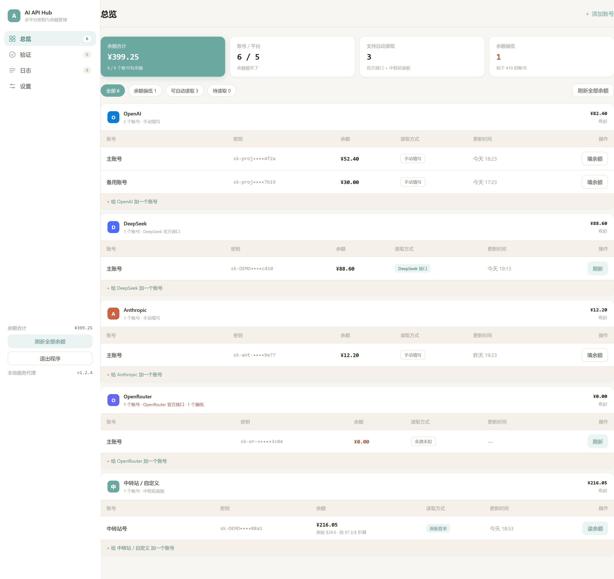
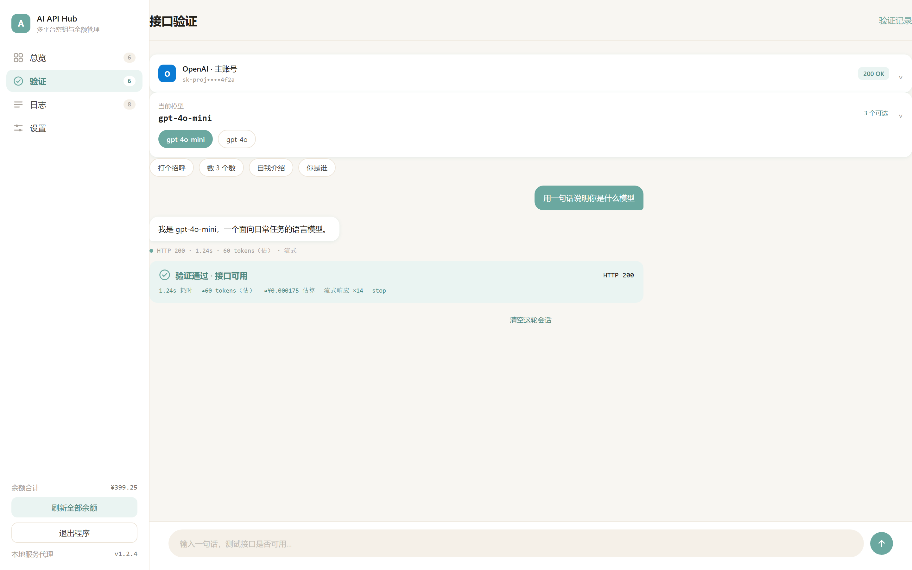
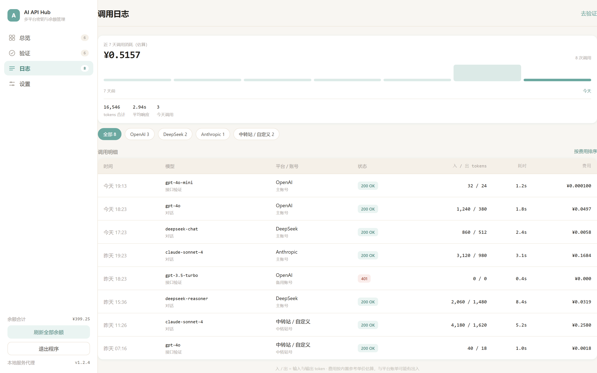
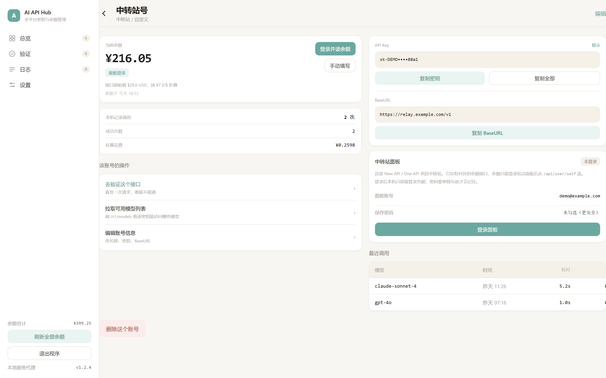
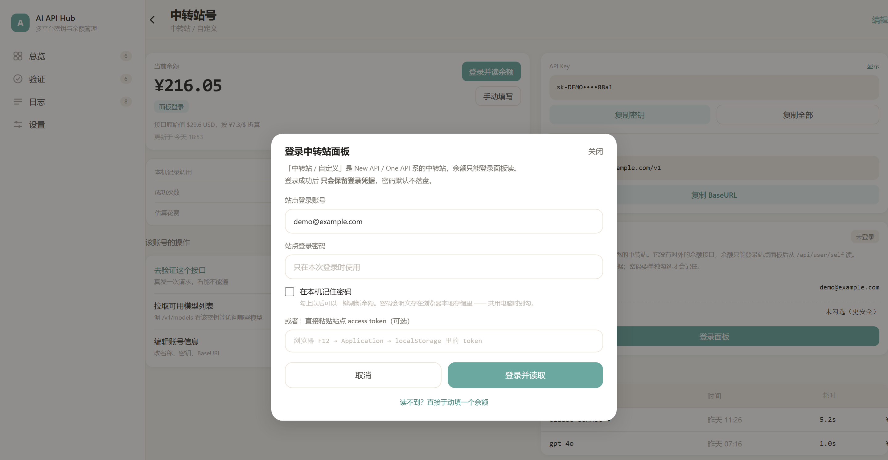
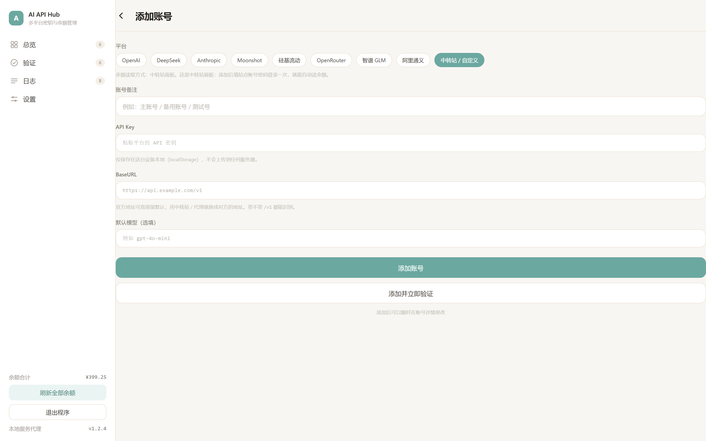
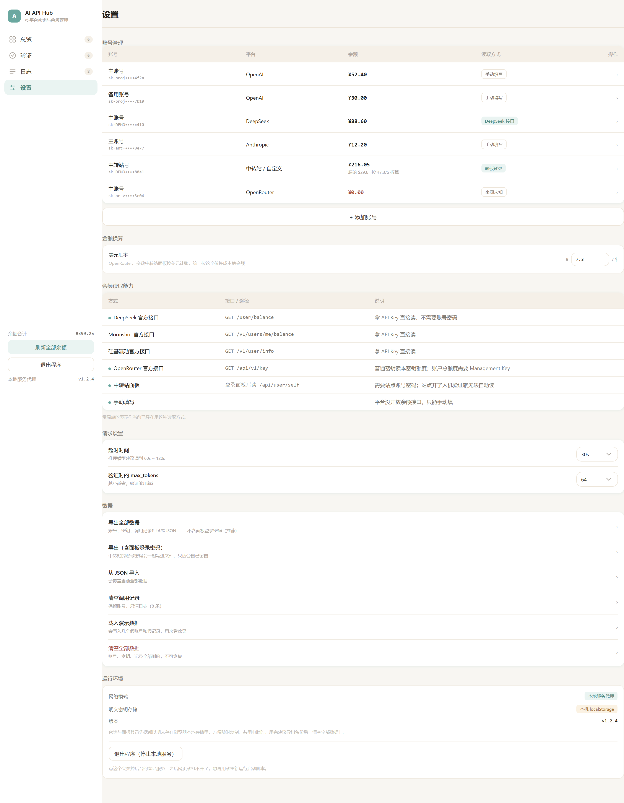

# AI API Hub

把散落在各家平台的大模型 API，集中到一处管理。

统一看余额、管密钥、一键复制 BaseURL，还能**直接选模型发一句话**验证这把密钥到底能不能用 —— 每次调用的 token、耗时、费用都自动记档。

余额不用再手动抄了：**填一次账号密码，工具自己去平台读。**

电脑端网页版 + 安卓 App，同一份前端代码。

| 总览 | 接口验证 | 调用日志 | 账号详情 |
| :---: | :---: | :---: | :---: |
|  |  |  |  |

| 中转站登录面板 | 添加账号 | 设置 |
| :---: | :---: | :---: |
|  |  |  |

---

## 它解决什么问题

从各家平台注册 API 之后，真实的麻烦是这样的：密钥散在十几个控制台的收藏夹里，余额要一个个登录去看，想确认「这把密钥还能不能用」得翻出 curl 命令手敲一遍，一个月下来花了多少钱完全没数。

这个工具把这四件事收进一个地方：

**1. 平台与账号管理**
一个平台下可以挂多个账号（主号 / 备用号 / 测试号）。总览按平台分组，每组的表头就是该平台的全账号合计，一眼看清哪个平台快见底了。

**2. 密钥保管与复制**
密钥只写在本机，不上传任何服务器。默认打码，一键复制密钥、复制 BaseURL，或者把整套凭证一次复制走。

**3. 余额自动读取** ← 不用再手动抄

分成两条路径，工具自己按平台判断走哪条：

**A. 平台自带余额接口的**，用 API Key 直接查，不需要登录：

| 平台 | 接口 | 币种 |
| --- | --- | --- |
| DeepSeek | `GET /user/balance` | 人民币 |
| Moonshot / Kimi | `GET /v1/users/me/balance` | 人民币 |
| 硅基流动 | `GET /v1/user/info` | 人民币 |
| OpenRouter | `GET /api/v1/key` | 美元 |

**B. 中转站（New API / One API 系面板）** 没有公开的余额接口，余额只存在于面板后台，必须**登录面板**才能读：

```
探站点 /api/status  →  开密码加密？取公钥 RSA-OAEP 加密密码  →  /api/user/login 换 token  →  /api/user/self 读余额
```

读到之后 `quota ÷ quota_per_unit` 就是美元余额，按汇率折算成人民币存下来，**原始金额同时留档**（详情页会显示「接口原始值 $29.60 USD，按 ¥7.3/$ 折算」），换汇率不会让历史数据失真。

外币兑换率在「设置 → 金额换算」里改，默认 7.3。

**关于密码，两条硬规矩：**

- **默认不保存。** 登录成功后只留 token，密码不落盘。想省事可以勾「在本机记住密码」，界面上会明确写出代价：*密码会明文存在浏览器本地存储里 —— 共用电脑时别勾。*
- **导出数据默认把密码和 token 一起剥掉。** 想连凭据一起备份，得走「含凭据」那个入口，是显式选择。

**一条必须说清楚的边界：** 有些中转站开了 Cloudflare 人机验证（站点 `/api/status` 里 `turnstile_check: true`）。**这种情况脚本登录不了 —— 验证码就是要挡住自动化的，绕不过去。** 工具会识别出来并直接告诉你，同时给两条替代路径：① 自己在浏览器登录后把 access token 粘进来；② 手动填一个余额。不假装成功，也不静默降级。

**4. 接口验证（真发请求）**
选账号 → 选模型（真去拉 `/v1/models`，不是写死的列表）→ 发一句话。能正常收到回复，这把密钥就是可用的。

**它对上游的返回格式不挑食**，这一点看着琐碎，实际上是能不能用的分水岭。所谓「OpenAI 兼容」至少有三副面孔，工具三种都认：

| 上游返回 | 例子 | 处理 |
| --- | --- | --- |
| 标准非流式 | `{"object":"chat.completion"}` | 直接取 `choices[0].message.content` |
| **SSE 流式** | `data: {"object":"chat.completion.chunk"}` | 逐片 `delta.content` 攒成完整正文 |
| 单个 chunk | `{"object":"chat.completion.chunk"}` | 当成只有一片的流处理 |

第二种最容易踩：**请求体里明明写着 `stream: false`，相当多中转站照样硬吐 SSE。** 只按第一种解析的话，HTTP 200 的可用密钥会被自己判成「无法解析 / 请求失败」——明明能用的 Key 显示成红的。

失败时不说「请求错误」，而是告诉你该干什么：

| 情况 | 界面会说什么 |
| --- | --- |
| 401 | 密钥无效或已被撤销 |
| 403 | 密钥有效，但没这个模型的权限 |
| 404 | BaseURL 或接口路径不对 |
| 429 | 被限流了 / 额度耗尽 |
| 5xx | 上游服务异常，不是你的配置问题 |
| 超时 | 请求在 N 秒内没有响应，已主动中断 |
| 域名不通 | 请求没能发出去 |
| 跨域 | 浏览器拦住了，用本地服务打开 |
| 认不出 | HTTP 通了但格式不认识 —— 附原始返回，可直接拿去适配 |

还有一个容易搞错的分界：**HTTP 200 + 正文是空的**，不等于失败。有些模型（尤其是带推理的）只回推理内容不给最终答案，这仍然证明密钥和链路是通的，界面会照实说「接口连通 · 但没返回正文」，而不是报错。

**5. 调用日志**
每次调用都留档：模型、输入/输出 token、响应耗时、估算费用、回复预览。费用按内置参考单价估算，模型名支持前缀匹配，所以 `gpt-4o-2024-08-06` 会命中 `gpt-4o` 的单价。**查不到单价的模型显示「未知单价」而不是 0** —— 报 0 是在骗自己。

流式响应基本不会回 `usage`（除非上游支持 `stream_options.include_usage`）。这种情况下不空着，而是按字符给个量级估算，并明确标成 `≈ 60 tokens（估）`—— 估算就是估算，不装成实测值。

---

## 两种形态，一份代码

| 形态 | 怎么用 | 怎么绕开跨域 |
| --- | --- | --- |
| **电脑端网页版** | 双击 `start.bat`（或 `npm start`），浏览器自动打开 | 本地 Node 服务做转发代理 |
| **安卓 App** | 从 [Releases](https://github.com/Xiaope555/API-management-platform/releases) 下载 APK，点开就装 | Capacitor 原生 HTTP，浏览器不参与 |

前端只有一套（`app/www/`），运行时自己判断在哪个壳里：

```
window.Capacitor.Plugins.CapacitorHttp 存在？ → native（APK）
/api/health 有响应且是本站？              → proxy （网页版，本地服务）
都没有                                    → direct（会被跨域拦，界面明确提示）
```

为什么要绕这么一圈：**浏览器里直接对 `api.openai.com` 发请求，一定会被 CORS 拦死。** 这不是配置问题，是浏览器的安全模型。所以「填 Key 就能真发请求」必须有个东西替它发 —— 要么本地服务，要么原生壳。两条路都搭好了。

### 布局：一套结构，两种形态

界面只有一份 DOM，宽窄切换全交给 CSS（断点 900px）：

| | ≥900px 电脑端 | <900px 手机端 |
| --- | --- | --- |
| 导航 | 左侧固定侧栏（常驻，带余额合计） | 顶部栏 + 抽屉菜单 + 底部 Tab |
| 账号/日志列表 | 表格 | 表格降级成卡片，表头借 `td::before` 挪到卡片上 |
| 弹层 | 居中对话框 | 底部上滑面板 |

所以手机上不存在「网页版表格挤成一团」的问题，电脑上也不会看到手机壳。安卓 App 与手机浏览器共用窄屏那一支。

---

## 跑起来

### 电脑端网页版

```bash
cd app
npm start          # → http://127.0.0.1:8787，会自动打开浏览器
```

Windows 上更省事：**双击 `app/start.bat`**。它会检查有没有 Node，然后起服务并自动打开浏览器。

不需要 `npm install` —— 网页版本身**零依赖**，只用 Node 内置模块（`npm install` 只是为了重新编译 APK 才需要装 Capacitor）。

端口被占用会自动往后试（8787 → 8788 → …），不用改代码。想指定端口：`node server.js --port=9000`。

**关掉它**：直接关掉那个黑窗口；或者在页面「设置 → 运行环境 → 退出程序」点一下（会调用 `/api/shutdown`）。

> 直接双击 `www/index.html` 也能打开，但会进 direct 模式，调 API 可能被拦。要真发请求就得起本地服务。

### 安卓 App

从 **[Releases](https://github.com/Xiaope555/API-management-platform/releases)** 下载最新的 `API-Hub-*.apk`，传到手机点开装（需要在系统设置里允许「安装未知来源应用」）。

包信息：`com.aihub.app` · 版本 1.2 · minSdk 24（Android 7.0 起）· targetSdk 36 · 只需 INTERNET 权限

也可以命令行装：`adb install -r API-Hub-1.2-debug.apk`

重新编译需要 JDK 21 + Android SDK 36，细节见 [`app/README.md`](app/README.md)。

---

## 工程结构

```
.
├── app/                        软件本体
│   ├── server.js               本地服务：静态托管 + /api/proxy 转发 + /api/health + /api/shutdown
│   ├── start.bat               双击起服务并自动开浏览器
│   ├── capacitor.config.json   安卓配置（webDir=www，CapacitorHttp 已开）
│   ├── www/                    前端（网页版与 App 共用这一份）
│   │   ├── index.html          一套结构：侧栏 + 内容区
│   │   ├── app.css             设计系统变量 + 全部组件样式 + 900px 断点
│   │   └── js/
│   │       ├── core.js         数据层 / 价格表 / 三级网络抽象 / 余额引擎 / 接口封装
│   │       ├── screens.js      总览 · 验证 · 日志 · 设置 · 账号详情 · 添加
│   │       └── main.js         路由、导航、发送逻辑
│   ├── tools/
│   │   ├── mock-upstream.js    模拟上游 + 模拟中转站面板（自测用，不参与运行）
│   │   ├── e2e.js              端到端自测驱动（无头 Chrome + CDP，零依赖）
│   │   ├── e2e-page.js         注入页面跑的主套件（166 条）
│   │   ├── e2e-desktop.js      切到 1440×900 复核电脑端计算值（22 条）
│   │   ├── shot.js             出 README 截图
│   │   └── build-android.ps1   跑 APK 编译
│   └── android/                Capacitor 生成的安卓工程
├── screenshots/                实际运行的界面截图
└── exports/                    设计稿
```

`server.js` 只监听 `127.0.0.1`，局域网里别的机器连不上；静态服务带目录穿越防护。

---

## 自测

```bash
cd app
npm start            # 另开一个终端
npm test
```

会自己拉起一个模拟上游平台，用无头 Chrome 通过 CDP 驱动**真实页面**（直接调它自己的 `Api` / `Store` / `Balance`，不是另写一份模拟代码），跑完断言再收尾：

```
  OK  SSE 上游：HTTP 200 判定为成功（不再误报失败）
  OK  只回推理内容时仍算「接口连通」
  OK  余额·DeepSeek 官方接口读到 88.60
  OK  余额·OpenRouter 充值型密钥自动退回 credits（10 - 0.5 = $9.5）
  OK  余额·面板：账号密码登录成功
  OK  余额·面板：RSA-OAEP 加密密码被真私钥解开 → 登录成功   ← 最有分量的一条
  OK  余额·面板：人机验证站点被识别并归类 turnstile
  OK  余额·凭据：没勾「记住密码」就绝不存密码
  OK  电脑端：顶栏的汉堡按钮 display 不是 flex            ← 曾经被权重盖住过
  OK  窄屏计算值：表格被降级成卡片（table 变成 block）
  OK  窄屏几何：底部 Tab 钉在视口内，没有被内容推出屏幕外   ← 「进了总览退不出去」就是它
  OK  窄屏几何：卡片里的值真的落在视口内                 ← 曾被 .tbl.wide 的 min-width 推出去
  OK  窄屏破坏性复核：外壳高度被打成 auto 后 Tab 仍在视口内  ← 复刻老 WebView 丢掉 dvh 的状态
  OK  返回键：系统返回会先退一层，回到总览                    ← 安卓返回键不再直接杀掉应用
  OK  导航：侧栏/抽屉底部有「退出程序」入口                    ← 原来只藏在设置页里
  OK  版本号：界面显示的版本 === 服务端正在跑的版本               ← 曾经硬编码 1.2.0 一直不同步
结果：188 / 188 通过
```

**那个「RSA-OAEP 被真私钥解开」是怎么验的**：模拟面板启动时用 `crypto.generateKeyPairSync` 现生成一对真 RSA 密钥，公钥下发给页面、私钥留在服务端。页面用 WebCrypto 按 `RSA-OAEP(SHA-256)` 加密密码提交，服务端拿私钥去解 —— **解得开，才说明浏览器侧的实现是字节级正确的**，而不是「看着像对」。这条路径在真站点上没法调试，只能在本地把它证明出来。

那个「模拟上游」也是刻意做歪的：`mock-stream` 系列三个模型**收到 `stream: false` 也照样回 SSE**，`mock-stream-error` 把错误藏在 HTTP 200 的流里；面板则分三套 —— 普通、开人机验证、开密码加密。真实世界里的中转站就是这么不守规矩，测试里得先复刻出来。

覆盖范围：模型列表拉取、对话补全、三种响应形状的解析、流内错误识别、usage 解析与缺失时的估算、费用估算与前缀匹配、日志写入与截断、导入导出往返、失败分类（401/403/404/429/超时/域名不通/跨域）、BaseURL 四种写法容错、三条网络通道各自的正确性、四家官方余额接口、中转站面板四种登录形态（明文 / 加密 / 人机验证 / 非面板地址）、凭据落盘与导出脱敏、以及电脑端与手机端两侧的真实计算样式。

---

## 数据与隐私

- 密钥、账号、日志全部存在本机 `localStorage`（键名 `aihub.v1`），不联网、不上传、无遥测
- 唯一的对外请求就是你配置的那些 API 地址
- 设置页可以导出成 JSON 备份（默认剥掉密码与 token），也可以一键清空

**这意味着 API 密钥是明文的。** 别在共用设备上保存生产密钥。中转站登录密码默认不落盘，token 会留 —— 想连 token 一起清掉，详情页有「清除凭据」。安卓版以后可以接 Keystore，网页版没有太好的办法 —— 这是纯前端方案的固有代价。
